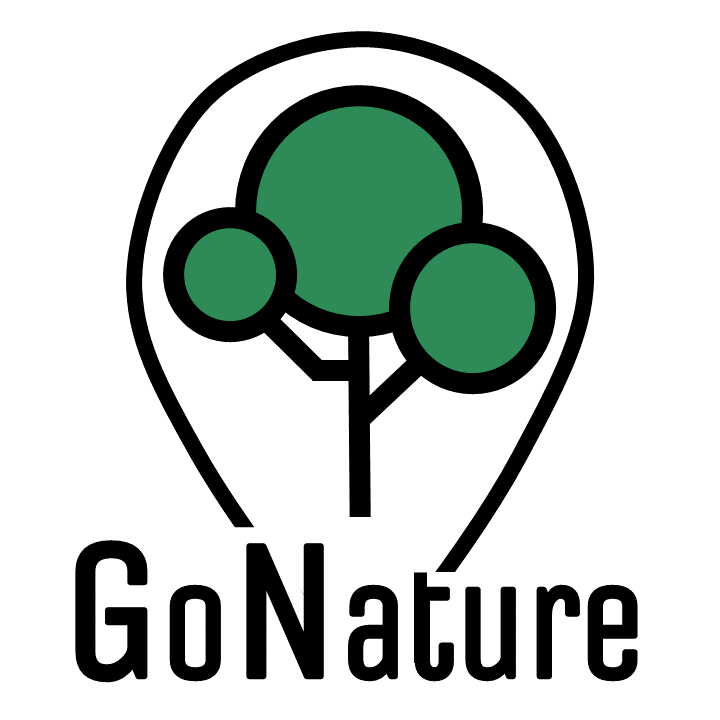

# GoNature-G9
Nature parks reservation and mannagment system (Java)
----------------------

----------------------

This project assigment was assigned and combined from three curses:
-	Software Development Methodologies
-	Human-computer interface
-	Introduction to software quality assurance

The company name is goNature and the task was to build software that will ease the management of multiple nature reserve parks, the software had to keep track of future reservation of the parks, both capacity wise and financial wise. We also had to allow users to make a new reservation, and notify them upon success or failure due to capacity limitations. The same software, besides being user-oriented was also had to be employee-oriented, and allow different kinds of employees to have different kinds of functionality, such as scanning visitors' reservations in the park entrance or produce revenue or capacity reports. The said software had to be built separately for server-side and client-side, each as its own project.

The task was not simple at all, but we were a strong team.
Like all projects we started with the planning, we used git and Jira as our main tools for project management and tried to work in an Agile oriented way, using SCRUM methodology.
We built the software using ocsf architecture, both frontend and backend sides were written in Java, for our database we choose to use MySQL.
For our GUI we used JavaFX combined with JFonix and CSS. We decided upon a clean design and made all the GUI assets and icons ourselves. The project was demanding, and sometimes felt never-ending but eventually, we overcame any trouble we had.
We built Test suites and test cases for our code and test the front-end functionality with Jubula.
Both of our Java projects were documented using JavaDoc.

Overall, we had a huge success and we learned a lot in the process (and we even got A+ grades).
A special thanks to all Group9 members:
g9 members profile links

